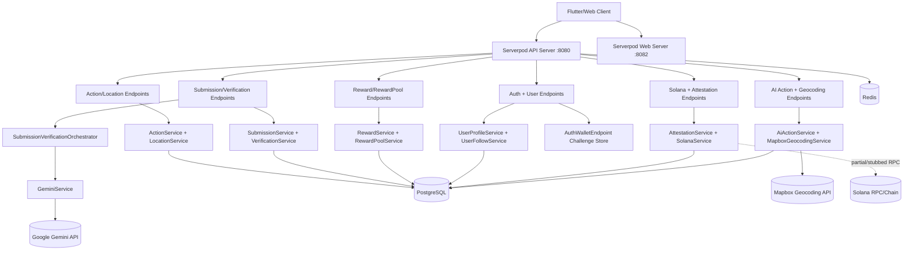
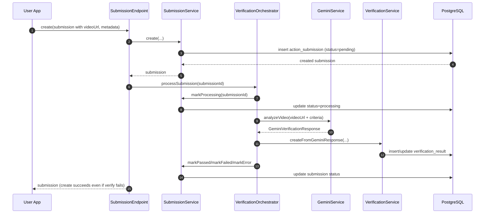

# Verily Research Notes (2026-02-27)

## Session Scope

Deep research for Verily focused on:

- short-form media capture authenticity (video, photo, audio),
- location verification strategy and geospatial backend support,
- multimodal model options for action verification,
- oracle feasibility on Solana (including Doppler integration tradeoffs and cost model),
- infrastructure direction (Pulumi, optional Kubernetes, deploy model, costs).

## Prompt Log

### Prompt 001 (Cleaned)

For Verily, we need to capture media from users' devices and verify that it was captured on-device and at the relevant time. We need deep research on the most performant architecture for short captures (initially short videos, but also photos, audio, location, and barcode scans).

Use cases include real-world actions such as:

- verifying someone went to a specific location and performed a task in video,
- verifying they spoke a required phrase,
- verifying they took photos with people at a location,
- verifying location-linked actions with barcode scans for stronger proof.

Location should not be a single point of trust because spoofing is possible. We want layered verification like "at this location, scan this barcode" plus media evidence.

Research goals:

- Best approach to video/media attestation and anti-spoofing.
- Best approach to location verification with realistic trust assumptions.
- Serverpod feasibility for location-aware backend and geospatial support:
  - check current codebase status,
  - determine how easily PostGIS support can be added and used.
- Video processing pipeline options:
  - likely short clips (around 15s),
  - possible client-side shrinking/compression before analysis,
  - Gemini-based verification initially,
  - possible double/triple verification models.
- Compare other multimodal models, including open-source options.
- Research infrastructure strategy and cost/credits:
  - Pulumi-managed infrastructure from this repo,
  - future service expansion (including potential Rust services),
  - CI/CD-driven service rollout with Docker,
  - whether Kubernetes provides meaningful benefits or unnecessary complexity.

### Prompt 002 (Cleaned)

Evaluate whether Verily can operate as a Solana oracle, using `https://github.com/blueshift-gg/doppler` as a candidate building block.

Research goals:

- Explain how a Verily oracle would work end-to-end:
  - off-chain verification in Verily backend,
  - optional/lazy publication of verified outcomes on-chain,
  - on-chain consumers querying whether an action is complete to unlock additional blockchain actions.
- Provide a practical architecture for "lazy oracle" behavior so on-chain writes happen only when needed.
- Assess Doppler specifically:
  - what it is good for,
  - what production risks it introduces,
  - how it could be integrated into Verily.
- Provide cost estimates for Solana oracle operation:
  - transaction fee model,
  - rent/account footprint considerations,
  - rough scaling scenarios for update volume.
- Provide pros/cons of the oracle approach for Verily overall.

### Prompt 003 (Cleaned)

Determine whether Verily needs custom on-chain program code for the oracle architecture, and whether we should implement that with `pina` (`https://github.com/pina-rs/pina`).

Research goals:

- Clarify when no custom program is needed vs when a custom program is mandatory.
- Determine whether Doppler can be used directly or requires self-deployment/forking.
- Provide a practical `pina` implementation path:
  - program architecture,
  - build/deploy workflow,
  - integration with existing Verily backend.

### Prompt 004 (Cleaned)

Visualize the current backend architecture with ASCII art and Mermaid diagrams.

Research goals:

- Show how requests flow through Serverpod endpoints and services.
- Show database/cache/external integrations in the current implementation.
- Highlight where behavior is currently synchronous, stubbed, or in-memory.

## Codebase Reality Check (Verified in Repo)

### What already exists

- Location, submission, verification, and attestation models/endpoints already exist.
- Infra already provisions PostgreSQL + Redis + object storage + compute via Pulumi (`infra/`).
- Local dev uses PostGIS-enabled Postgres images (`docker-compose.yaml`) and devenv includes PostGIS extension support (`devenv.nix`).

### Critical gaps

- Geospatial queries are not PostGIS-backed yet.
  - `LocationService.findNearby` explicitly has a PostGIS TODO and currently does in-memory Haversine over all rows.
  - `ActionEndpoint.listNearby` and `listInBoundingBox` are also application-layer filtering.
- Device attestation is currently stubbed.
  - `verifyPlayIntegrity` and `verifyAppAttest` store records with `verified: true` and TODO comments.
- Gemini verification path is MVP-level.
  - Current flow passes a `videoUrl` in prompt text and does not yet upload media bytes directly.
- No explicit async verification worker queue is implemented yet in server code.
- No Serverpod migration directory is present in this repo at the moment (`verily_server/migrations` missing).

### Relevant files

- `verily_server/lib/src/services/location/location_service.dart`
- `verily_server/lib/src/endpoints/action_endpoint.dart`
- `verily_server/lib/src/services/verification/attestation_service.dart`
- `verily_server/lib/src/verification/gemini_service.dart`
- `infra/src/aws/database.ts`
- `infra/src/gcp/database.ts`
- `docker-compose.yaml`
- `devenv.nix`

## Research Synthesis

### 1) Media Authenticity: Practical Architecture

### Decision

Use a layered trust model, not a single control:

- one-time server challenge,
- platform attestation (Play Integrity / App Attest),
- visual nonce proof in media,
- server-side freshness binding,
- model-based forensic checks,
- risk scoring and policy tiers.

### Recommended capture flow (MVP)

1. Server creates short-lived `capture_challenge` with nonce and expiry.
2. Client records media with challenge instructions rendered on-screen.
3. Client computes media hash and sends submission metadata.
4. Android sends Play Integrity verdict tied to request hash.
5. iOS sends App Attest assertion tied to challenge/client data hash.
6. Server verifies attestation + challenge freshness and stores signed evidence record.
7. AI verification decides pass/fail with confidence and spoofing signals.
8. Risk policy decides auto-accept, manual review, or reject.

### Notes

- EXIF/container metadata is useful but should be treated as advisory, not primary proof.
- C2PA is useful for provenance and portability, but not sufficient by itself for anti-fraud freshness guarantees.

### 2) Location Trust and Geospatial Strategy

### Decision

Treat GPS as a weak signal. Require multi-signal proof for meaningful rewards.

### MVP rule of thumb

- Do not allow location-only completion for valuable actions.
- Preferred composition:
  - `location + signed short-TTL QR/barcode scan + media proof`.
- Add optional proximity signals over time (BLE, Wi-Fi RTT where feasible).

### Serverpod + PostGIS implementation approach

- Keep existing `latitude/longitude` model fields for protocol compatibility.
- Add PostGIS `geography(Point, 4326)` sidecar column via migration SQL.
- Use raw SQL for geospatial operations from a dedicated geospatial service layer.
- Add GiST indexes and move nearby/bbox queries into DB-native queries.

### 3) Model Stack for Video Verification

### Time-sensitive findings (as of 2026-02-27)

- Gemini `2.0` Flash family is deprecated with published shutdown schedule (June 1, 2026).
- Gemini `2.5` Flash also has a listed shutdown date (June 17, 2026), so migration planning must be continuous.

### Decision

Primary stack:

- First-pass: `gemini-2.5-flash-lite` (cheap, fast).
- Adjudication pass: `gemini-2.5-flash` (higher quality on contested/ambiguous cases).

Fallback stack:

- Cross-vendor hosted fallback: Amazon Nova or Qwen hosted API path (visual-focused fallback).
- Self-host fallback: `Qwen2.5-VL-7B` for resiliency/data-control scenarios.

### Notes

- Keep response schema strict JSON with evidence timestamps and missing-step fields.
- Use disagreement policy: if model A and model B disagree, send to review queue.
- Audio-in-video capability differs by provider; verify this before depending on speech checks.

### 4) Infrastructure Direction (Pulumi + Kubernetes Decision)

### Decision

Pulumi is a good fit for one-repo control and staged growth. Kubernetes is not needed for MVP.

### Recommended MVP topology

- API service: Serverpod.
- Ingestion: client direct upload to object storage via signed URLs.
- Verification queue: async jobs (queue + worker service).
- Results + audit: PostgreSQL.
- Caching/rate controls: Redis.
- Infra control plane: Pulumi + ESC + CI path filtering.

### Kubernetes decision gate

Move to Kubernetes only when most are true:

- many independently deployed services with different scaling envelopes,
- dedicated platform/SRE ownership,
- hard multi-tenant isolation or compliance constraints,
- current managed container model is causing persistent operational drag.

### Why

- Managed K8s adds control-plane cost and operational burden.
- Queue + managed workers usually solve early-stage verification workloads with less risk.

### 5) Oracle Feasibility on Solana (Doppler + Verily)

### Product framing

Verily's "truth" is produced off-chain (media + location + barcode + challenge + model decision), but smart contracts need a compact on-chain fact:

- `claim_status(action, performer, claim_id) = passed | failed | pending`,
- an attested timestamp/sequence,
- a hash pointer to off-chain evidence.

This is a good oracle use case as long as policy truth is explicit that Verily is the trust source.

### Recommended oracle pattern for Verily

Use a **lazy write-through oracle**:

1. Verily verifies submission off-chain and stores immutable verdict record.
2. Nothing is written on-chain by default.
3. When a consumer program/user needs on-chain proof, they trigger request/fulfill:
   - request enters queue (off-chain),
   - Verily oracle relayer posts compact verdict update on-chain,
   - consumer program reads oracle account and unlocks flow.
4. Cache the on-chain result so repeated checks are reads-only.

This gives low baseline cost and preserves "queryable on-chain" behavior.

### Suggested on-chain data schema (compact)

Minimal account payload (target roughly 128-256 bytes):

- `version`
- `sequence` (monotonic, replay protection)
- `claim_id_hash` (hash of Verily claim UUID)
- `action_id_hash`
- `performer_pubkey`
- `status` (`0=pending`, `1=passed`, `2=failed`)
- `verified_at_unix`
- `expires_at_unix` (optional TTL)
- `evidence_hash` (hash of canonical off-chain evidence package)
- `verifier_policy_hash` (optional policy version integrity)

Never put raw video/audio/PII on-chain.

### Doppler-specific feasibility

Based on repository/docs reviewed on 2026-02-28:

- Doppler is positioned as a very low-CU oracle update path ("21 CU" update claim).
- It supports generic payloads and sequence-based update ordering.
- It is explicitly permissioned by an admin signer model.
- Current docs/code indicate hardcoded admin assumptions.
- `SECURITY.md` states it is un-audited and pre-production.

### What Doppler is good for

- Fast prototype path for a compact Verily verdict feed.
- Low compute profile if update path remains simple.
- Good fit for "single trusted publisher" architecture in early stages.

### Doppler risks for production Verily

- Centralized signer trust: compromise blocks correctness guarantees.
- Hardcoded admin model complicates key lifecycle and governance.
- No published audit at time of research.
- Operational dependence on one signing authority unless forked/hardened.

### Practical recommendation

- **Devnet/Testnet**: Doppler is reasonable for rapid proof-of-concept.
- **Mainnet production**: fork/harden before relying on it for value-bearing unlocks, or implement a Verily-owned oracle program with:
  - upgrade/governance policy,
  - key rotation controls,
  - multi-sig/hardware-backed signer policy,
  - clear SLA/monitoring and replay safeguards.

### Solana cost model (oracle-focused)

### Fee primitives

- Base fee is 5,000 lamports per signature.
- Priority fee formula: `compute_unit_limit * compute_unit_price` (micro-lamports) converted to lamports.
- Effective per-update fee for this design is typically base fee plus small priority increment.

### Assumptions for estimates

- Pricing snapshot timestamp: 2026-02-28 08:26:56 UTC.
- SOL/USD used for conversion: `$78.32`.
- Per-update fee scenarios:
  - `5,000` lamports (base only),
  - `5,200` lamports (base + light priority),
  - `6,000` lamports (base + higher priority).

### Transaction cost scenarios

| On-chain oracle updates | 5,000 lamports/update  | 5,200 lamports/update  | 6,000 lamports/update  |
| ----------------------- | ---------------------- | ---------------------- | ---------------------- |
| 10,000 updates          | 0.0500 SOL (`$3.92`)   | 0.0520 SOL (`$4.07`)   | 0.0600 SOL (`$4.70`)   |
| 100,000 updates         | 0.5000 SOL (`$39.16`)  | 0.5200 SOL (`$40.73`)  | 0.6000 SOL (`$46.99`)  |
| 1,000,000 updates       | 5.0000 SOL (`$391.60`) | 5.2000 SOL (`$407.26`) | 6.0000 SOL (`$469.92`) |

Lazy publication scales cost down linearly. Example: if only 15% of 1,000,000 verified actions are published, 150,000 updates at 5,200 lamports/update is about `0.78 SOL` (`$61.07`).

### Rent (one-time, refundable if account closed)

Mainnet RPC `getMinimumBalanceForRentExemption` samples:

| Account size | Rent-exempt lamports | SOL        | USD (`$78.32/SOL`) |
| ------------ | -------------------- | ---------- | ------------------ |
| 128 bytes    | 1,781,760            | 0.00178176 | `$0.14`            |
| 256 bytes    | 2,672,640            | 0.00267264 | `$0.21`            |
| 512 bytes    | 4,454,400            | 0.00445440 | `$0.35`            |
| 1024 bytes   | 8,017,920            | 0.00801792 | `$0.63`            |

### Cost takeaway

- On-chain oracle write fees are usually small relative to AI verification/video processing costs.
- Main operational risk/cost is reliability of signer + relayer + RPC, not just lamports.
- Lazy writes materially improve economics for early-stage product usage.

### Oracle approach pros/cons for Verily

### Pros

- On-chain composability: external programs can gate actions on Verily-verified outcomes.
- User-verifiable state transitions for reward unlocks.
- Strong fit for Solana-native reward mechanics without putting raw media on-chain.
- Lazy pattern keeps costs near-zero until on-chain proof is actually needed.

### Cons

- Trust concentration remains in Verily unless using a decentralized attester set.
- Additional security surface (signer management, replay prevention, relayer reliability).
- Smart contract integration complexity and versioning overhead.
- Incorrect off-chain verdicts can become on-chain facts unless dispute/revocation model exists.

### Verily integration outline (with current codebase)

1. Keep current submission verification in backend (`verification_service`, `submission_service`).
2. Add canonical `VerificationEvidence` object and deterministic evidence hash.
3. Extend `SolanaService` from wallet stubs to oracle relayer client path.
4. Add an `OraclePublication` table:
   - claim id,
   - publish state,
   - sequence,
   - tx signature,
   - failure reason/retry count.
5. Add `publishOracleVerdict(claimId)` endpoint and background worker.
6. Add idempotency + replay protection:
   - monotonic sequence per feed,
   - duplicate publish checks by claim hash.
7. Add consumer-program integration spec for unlock checks (`status + TTL + evidence hash`).

### 6) Do We Need To Deploy Our Own Program? (Pina Path)

### Direct answer

If Verily wants on-chain consumers to trustlessly check "was this action verified?" and unlock on-chain behavior, then **yes, you need on-chain program code**.

### Decision matrix

- No custom program needed:
  - Verily backend is the final authority and directly sends reward transactions after verification.
  - Blockchain is only used for payment settlement, not for independent oracle queries.
- One program needed:
  - You only need public on-chain oracle records (read by clients/indexers), and no custom unlock logic.
  - You can use an oracle program for writes plus account reads.
- Two programs typically needed (recommended for Verily):
  - `oracle program` stores verdict facts on-chain.
  - `consumer/unlock program` enforces how those facts unlock rewards/actions.

### Why Doppler likely still requires your own deployment

Current Doppler code checks a hardcoded admin key and only allows that signer to update oracle data. Its own security policy also states un-audited/pre-production status.

Practical implication:

- If you use Doppler as-is, your backend cannot safely operate as the long-term publisher unless you depend on external admin control.
- For Verily-controlled production publishing, deploy your own oracle program (either Doppler fork or Verily-native program).

### Recommended program set with `pina`

1. `verily_oracle_program` (required)
   - Stores compact claim verdict state in PDA accounts.
   - Instructions:
     - `initialize_config` (authority + signer config)
     - `publish_verdict` (single claim)
     - `publish_verdict_batch` (optional throughput)
     - `rotate_publisher` (key rotation)
     - `revoke_or_expire_verdict` (policy repair path)
2. `verily_unlock_program` (required when unlock rules are custom)
   - Reads oracle verdict account.
   - Verifies:
     - oracle account owner/discriminator,
     - matching `action_id` / `performer`,
     - verdict status and TTL,
     - replay prevention (`consumed` marker PDA).
   - Executes reward/action unlock atomically.

### Why `pina` is a good fit here

- Native Solana program framework with low-CU focus and zero-copy account handling.
- Explicit account validation chaining, useful for oracle and unlock safety checks.
- Built-in path for IDL + client generation (`pina idl`, Codama flow).
- Clear no_std/SBF build pattern suitable for production program crates.

### Pina workflow (practical)

1. Scaffold program:
   - `pina init verily_oracle_program`
2. Implement account/instruction types with discriminators.
3. Add authority checks (`assert_signer`, owner checks, PDA seed checks).
4. Build SBF artifact:
   - `cargo +nightly build --release --target bpfel-unknown-none -p verily_oracle_program -Z build-std=core,alloc -F bpf-entrypoint`
5. Deploy:
   - `solana program deploy <PROGRAM_SO_PATH>`
6. Generate IDL/clients:
   - `pina idl --path ./programs/verily_oracle_program --output ./idls/verily_oracle_program.json`

### Serverpod integration impact

- Extend `SolanaService` beyond wallet/balance stubs to include oracle publish operations.
- Add backend relayer queue that submits signed oracle updates.
- Persist publication metadata (`sequence`, `signature`, retries, finality status) for auditability.
- Keep unlock-critical checks on-chain, while AI/media verification remains off-chain.

### Effort estimate (engineering)

- Devnet MVP (`verily_oracle_program` + backend publisher): about 1-2 weeks.
- Production hardening (rotation controls, monitoring, failure handling, policy repair paths): about 3-5 additional weeks.
- External security review/audit window should be planned separately before high-value mainnet usage.

### 7) Current Backend Visualization (As Implemented)

### ASCII system view

```text
                              +----------------------+
                              |   Flutter/Web App    |
                              |   + verily_client    |
                              +----------+-----------+
                                         |
                                         | RPC
                                         v
+-----------------------------------------------------------------------+
|                         Serverpod (verily_server)                     |
|                                                                       |
|  API Server :8080                                                     |
|    - action, submission, verification, attestation, reward, wallet    |
|    - aiAction, location, geocoding, userProfile, userFollow, auth*    |
|                                                                       |
|  Insights :8081                                                       |
|  Web      :8082 (/, /app, static files, app config route)            |
|                                                                       |
|  Endpoint Layer -> Service Layer                                      |
|    - SubmissionEndpoint -> SubmissionService -> VerificationOrchestrator
|    - VerificationOrchestrator -> GeminiService                        |
|    - AttestationEndpoint -> AttestationService                        |
|    - GeocodingEndpoint -> MapboxGeocodingService                      |
|    - SolanaEndpoint/AuthWalletEndpoint -> SolanaService               |
+-------------------+-------------------------+-------------------------+
                    |                         |                         |
                    v                         v                         v
         +--------------------+     +-------------------+     +------------------+
         | PostgreSQL (PostGIS)|    | Redis (enabled dev)|     | External APIs    |
         | Serverpod tables     |    | sessions/cache/logs|     | - Gemini         |
         | action, submission,  |    +-------------------+     | - Mapbox         |
         | verification_result, |                              | - Solana (partial|
         | reward*, wallet, ... |                              |   stubs today)   |
         +----------------------+                              +------------------+
```

### Mermaid: Component topology



### Mermaid: Submission verification flow (current)



### Current-state caveats (important)

- Submission verification is triggered inline from `SubmissionEndpoint.create` (no separate queue worker yet).
- `GeminiService` currently sends `videoUrl` in prompt text (not direct byte upload pipeline).
- `AttestationService` Play Integrity / App Attest verification is stub-gated by run mode/config.
- `LocationService.findNearby` uses in-memory Haversine fallback; PostGIS SQL path is TODO.
- `AuthWalletEndpoint` challenge store is in-memory map (not Redis/DB backed yet).

## Recommended Verily Implementation Plan

### Phase 0 (Immediate)

- Replace current attestation stubs with real server-side verification paths.
- Add challenge binding fields to submission payload and audit trail.
- Introduce async verification queue (submission -> worker -> verification result).
- Switch default model target from Gemini `2.0` Flash to `2.5` Flash/Lite.

### Phase 1 (Geo Foundation)

- Add Serverpod migration scaffolding.
- Enable PostGIS extension in DB and migration SQL.
- Add `geography` column + GiST indexes.
- Replace in-memory nearby/bbox with raw PostGIS queries.

### Phase 2 (Trust Hardening)

- Enforce challenge-in-media checks as required criterion.
- Add risk scoring combining:
  - attestation verdict quality,
  - freshness checks,
  - location plausibility,
  - model spoofing indicators.
- Add manual review queue for low-confidence or policy-flagged submissions.

### Phase 3 (Scale and Resilience)

- Add dual-model adjudication for high-value actions.
- Add regional worker pools and queue-driven autoscaling.
- Add provenance enhancements (C2PA) for user-shareable proof artifacts.

### Phase 4 (Solana Oracle Rollout)

- Implement lazy oracle publication path in backend and queue worker.
- Ship devnet oracle proof-of-concept with Doppler-compatible payload.
- Define mainnet hardening gate:
  - audited oracle program path,
  - signer policy (KMS/HSM + rotation),
  - monitoring + replay alerts,
  - rollback/dispute playbook.
- Integrate consumer-program unlock checks against oracle state.

### Phase 5 (Pina Program Productization)

- Implement Verily-owned oracle program with `pina` and explicit key rotation instruction(s).
- Add consumer unlock program for on-chain gated rewards/actions.
- Generate and version IDLs/clients for app/backend integrations.
- Add release process:
  - deterministic builds,
  - deployment manifest per cluster,
  - post-deploy verification and smoke tests.

## Infrastructure and Cost Notes

- AWS Activate page currently advertises applications for up to `$100,000` credits.
- Google for Startups Cloud Program currently advertises coverage up to `$200,000` (and up to `$350,000` for AI startups) with stated terms.
- Microsoft for Startups provides credits/benefits tiers, but exact amounts should be re-confirmed in active portal terms before planning.
- For Solana oracle operations, include dedicated budget for:
  - managed RPC (availability + latency),
  - signer infrastructure (KMS/HSM and key ceremony),
  - relayer monitoring/alerting and failover.

## Open Questions to Resolve Next

- Which exact action categories require strict attestation versus lighter trust policy?
- Should challenge rendering happen in native camera overlay only, or can imported media ever be allowed?
- What is the reviewer SLA and acceptable false-positive rate?
- What is the initial retention policy for raw media vs derived verification artifacts?
- What is the revocation/dispute policy if an already-published on-chain verdict is later found to be incorrect?
- Should Verily ship a single oracle-only program first, or ship oracle + unlock program together?

## Source Index

### Code references (current backend map)

- `verily_server/lib/server.dart`
- `verily_server/lib/src/generated/endpoints.dart`
- `verily_server/lib/src/endpoints/submission_endpoint.dart`
- `verily_server/lib/src/endpoints/verification_endpoint.dart`
- `verily_server/lib/src/endpoints/attestation_endpoint.dart`
- `verily_server/lib/src/endpoints/auth_wallet_endpoint.dart`
- `verily_server/lib/src/services/verification/submission_verification_orchestrator.dart`
- `verily_server/lib/src/verification/gemini_service.dart`
- `verily_server/lib/src/services/verification/attestation_service.dart`
- `verily_server/lib/src/services/location/location_service.dart`
- `verily_server/lib/src/services/location/mapbox_geocoding_service.dart`
- `verily_server/lib/src/services/wallet/solana_service.dart`
- `verily_server/lib/src/models/*.spy.yaml`
- `verily_server/config/development.yaml`
- `docker-compose.yaml`
- `infra/src/**`

### Device attestation and media trust

- https://developer.android.com/google/play/integrity/overview
- https://developer.android.com/google/play/integrity/standard
- https://developer.android.com/google/play/integrity/verdicts
- https://developer.apple.com/documentation/devicecheck/establishing-your-app-s-integrity
- https://developer.apple.com/documentation/devicecheck/validating-apps-that-connect-to-your-server
- https://developer.apple.com/videos/play/wwdc2021/10244/
- https://spec.c2pa.org/specifications/specifications/2.2/specs/C2PA_Specification
- https://github.com/contentauth/c2pa-android
- https://datatracker.ietf.org/doc/html/rfc3161

### Location and geospatial

- https://docs.serverpod.dev/concepts/database/raw-access
- https://docs.serverpod.dev/concepts/database/migrations
- https://postgis.net/docs/ST_DWithin.html
- https://postgis.net/docs/ST_Intersects.html
- https://postgis.net/docs/ST_ClusterDBSCAN.html
- https://postgis.net/docs/using_postgis_dbmanagement.html
- https://developer.android.com/reference/android/location/Location#isMock()
- https://developer.android.com/develop/connectivity/wifi/wifi-rtt
- https://www.faa.gov/air_traffic/nas/gps_reports

### Models and verification APIs

- https://ai.google.dev/gemini-api/docs/video-understanding
- https://ai.google.dev/gemini-api/docs/models
- https://ai.google.dev/gemini-api/docs/pricing
- https://ai.google.dev/gemini-api/docs/deprecations
- https://ai.google.dev/gemini-api/docs/changelog
- https://ai.google.dev/gemini-api/terms
- https://docs.aws.amazon.com/nova/latest/nova2-userguide/using-multimodal-models.html
- https://www.alibabacloud.com/help/en/model-studio/vision
- https://arxiv.org/abs/2502.13923
- https://arxiv.org/abs/2407.11418

### Infrastructure, Pulumi, Kubernetes, credits

- https://www.pulumi.com/docs/iac/using-pulumi/automation-api/concepts-terminology/
- https://www.pulumi.com/docs/deployments/deployments/using/settings/
- https://www.pulumi.com/docs/deployments/deployments/oidc/
- https://www.pulumi.com/docs/iac/guides/continuous-delivery/github-actions/
- https://kubernetes.io/docs/setup/production-environment/
- https://aws.amazon.com/eks/pricing/
- https://cloud.google.com/kubernetes-engine/pricing
- https://docs.aws.amazon.com/AmazonECS/latest/developerguide/capacity-autoscaling-best-practice.html
- https://docs.aws.amazon.com/AmazonS3/latest/userguide/using-presigned-url.html
- https://aws.amazon.com/startups/credits
- https://startup.google.com/cloud/
- https://www.microsoft.com/en-us/startups

### Solana oracle and Doppler

- https://github.com/blueshift-gg/doppler
- https://raw.githubusercontent.com/blueshift-gg/doppler/master/README.md
- https://raw.githubusercontent.com/blueshift-gg/doppler/master/SECURITY.md
- https://github.com/pina-rs/pina
- https://raw.githubusercontent.com/pina-rs/pina/main/readme.md
- https://docs.rs/pina
- https://solana.com/docs/core/programs
- https://solana.com/docs/core/accounts
- https://solana.com/docs/core/fees
- https://solana.com/docs/rpc/http/getminimumbalanceforrentexemption
- https://api.mainnet-beta.solana.com
- https://www.coingecko.com/en/api/documentation

## Confidence Notes

- High confidence:
  - current codebase gap analysis,
  - Serverpod raw SQL + migration strategy,
  - PostGIS query/index direction,
  - Pulumi one-repo viability,
  - deprecation risk for Gemini 2.0/2.5 model families,
  - oracle architecture fit for lazy on-chain publishing model,
  - requirement for custom program deployment when trustless on-chain unlock logic is desired,
  - backend topology diagrams accurately reflect current endpoint/service wiring.
- Medium confidence:
  - exact long-term pricing assumptions,
  - exact startup credit eligibility outcomes per organization,
  - long-run Doppler production readiness without a dedicated audit/hardening phase,
  - exact implementation timeline variance across internal team capacity and audit scope.
